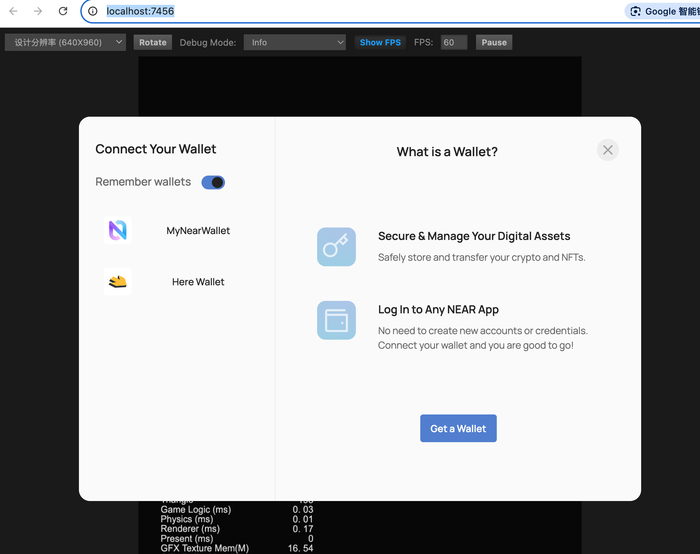

# Near-api-cocos

A package library that combines Near basic api and near-wallet-selector, mainly used in cocos creator.

Currently tested on cocos creator 3.8.4



## Usage
```bash
# Install dependent modules
npm i

# Compile
npm run build
```

After the compilation is complete, import the ```near-api-cocos.min.js``` in the dist directory as a module into the cocos creator, and then write the following in the code:
```
import { _decorator, Component, Node } from 'cc';
import nearAPI from "./near-api-cocos.min.js";

const { ccclass, property } = _decorator;
const { Wallet } = nearAPI;

@ccclass('Game')
export class Game extends Component {
    selector = void 0
    networkId = "testnet"
    createAccessKeyFor = "max30.necklace-dev.testnet"
    wallet = new Wallet({ networkId: this.networkId, createAccessKeyFor: this.createAccessKeyFor });

    start() {

    }

    update(deltaTime: number) {

    }

    onLoad() {
        // console.log("nearAPI:", Wallet, this.wallet)
        this.wallet.startUp(this.changeHook)
    }

    changeHook(account) {
        console.log("account: ", account)
    }

    async onClick() {
        this.wallet.signIn()
    }
}
```